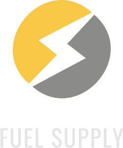

<h1 align="center">
    
</h1>

<h1 align="center">FuelSupply</h1>

<p align="center">FuelSupply o projeto para mudar a maneira de comprar e vender combustiveis</p>

<h4 align="center"> 
	🚧 MVP Pronto 🚧
</h4>

Tabela de conteúdos
=================
<!--ts-->
   * [Tabela de Conteudo](#tabela-de-conteudo)
   * [Sobre](#Sobre)
   * [Features](#Features)
   * [Como usar](#como-usar)
      * [Pre Requisitos](#pre-requisitos)
      * [Como Instalar](#como-instalar)
   * [Tecnologias](#tecnologias)
<!--te-->

## 💻 [Sobre](#Sobre)

O projeto FuelSupply é um projeto para a materia de projeto integrador de turma do 6º termo de ADS 2021 da Unimar - Universidade de Marília, professor Victor Borba.

Este projeto visa conectar consumidores que querem ecomizar no abastecimento de veiculos, e postos de combustiveis que visam vender mais.

Para o MVP trouxemos as seguintes funcionalidades tanto para os consumidores quanto para os postos

Os postos de combustiveis poderam:

- Se cadastrar na aba web do projeto 
- Cadastrar e editar os combustiveis disponiveis para venda
- Acompanhar as vendas de credito de combustiveis
- Editar as informações do seu cadastro
- Efetuar o checkout do uso do credito junto ao consumidor no momento do abastecimento

Os consumidores poderam: 

- Se cadastrar através do aplicativo
- Editar seus dados cadastrais 
- Efetuar a compra do credito de combustivel
- Acompanhar o historico de compras e utilizações dos creditos
- Efetuar o checkout do credito no momento do abastecimento

## [Features](#Features)

- [x] Cadastro de Posto
- [x] Cadastro de combustiveis
- [x] Edição de combustiveis
- [x] Listagem de vendas
- [x] Editar informações do Posto
- [x] checkout Posto da compra de credito

- [x] Cadastro de usuario
- [x] Editar informações do usuario
- [x] Efetuar compra do credito
- [x] Listagem das compras de credito
- [x] Listagem das utilizações de credito
- [x] checkout do usuario no abastecimento


## [Como usar](#como-usar)

### Pré-requisitos

Antes de começar, você vai precisar ter instalado em sua máquina as seguintes ferramentas:
[Git](https://git-scm.com), [Node.js](https://nodejs.org/en/), [React Native](https://reactnative.dev/), 
[Android Studio + Virtual Device Android >= 9.0](https://developer.android.com/studio), [Docker](https://docs.docker.com/docker-for-windows/install/), [MySQLworkbench](https://www.mysql.com/products/workbench/)
Além disto é bom ter um editor para trabalhar com o código como [VSCode](https://code.visualstudio.com/)

### 🎲 Rodando o Back End (API)

```bash

#Instanciando mariadb no docker
docker run -p 3306:3306  --name some-mariadb -e MARIADB_ROOT_PASSWORD=my-secret-pw -d mariadb

# Abra o MySQLworkbench e crie a conexão 
Link para ajudar a criar a conexão https://www.youtube.com/watch?v=qa7SWCozY_A

# crie o banco com sql deste Link 
https://drive.google.com/file/d/18a3vpPKT0lKT28bvfA1etXHUGVnWkHf_/view?usp=sharing

# Clone este repositório
$ git clone <https://gitlab.com/unimar-ads/fuel-supply/fuel-supply-app.git>

# Acesse a pasta do projeto no terminal/cmd
$ cd fuel-supply-app

# Vá para a pasta api
$ cd api

# Instale as dependências
$ npm install

#conectar mysql com a API
link do video para conectar o mysql com a api : https://www.youtube.com/watch?v=642J5YzLXDk

# Execute a aplicação
$ npm start

# o Server vai inicar em  <http://localhost:3000>

# A API também ja esta online no serviço heroku url base: https://fuel-supply-api.herokuapp.com/ 


```

### 💻 Rodando Cliente web

```bash

# Clone este repositório
$ git clone <https://gitlab.com/unimar-ads/fuel-supply/fuel-supply-app.git>

# Acesse a pasta do projeto no terminal/cmd
$ cd fuel-supply-app

# Vá para a pasta web
$ cd web

# Instale as dependências
$ npm install

# Execute a aplicação 
$ npm run serve

# A aplicação inciará na porta:8080 - acesse <http://localhost:8080>


```

### 📱 Rodando APP

```bash

# Clone este repositório
$ git clone <https://gitlab.com/unimar-ads/fuel-supply/fuel-supply-app.git>

# Acesse a pasta do projeto no terminal/cmd
$ cd fuel-supply-app

# Vá para a pasta app
$ cd app

# Instale as dependências
$ npm install
$ npm install --g expo-cli

# Execute a aplicação 
$ expo start

# Será aberto uma pagina no seu navegador baixa o app Expo em seu dispositivo, e escanei o QR code que esta na pagina do seu navegador

```

### 🛠 [Tecnologias](#tecnologias)

As seguintes ferramentas foram usadas na construção do projeto:

- [Node.js](https://nodejs.org/en/)
- [React Native](https://reactnative.dev/)
- [Vue.js](https://vuejs.org/)
- [Expo](https://expo.dev/)

## Autores

Feito por Emerson Willian,Ana Paula, Willian Santos 👋🏽


## 📝 Licença

Este projeto esta sobe a licença [MIT](https://gitlab.com/unimar-ads/fuel-supply/fuel-supply-app/-/blob/master/LICENSE).


